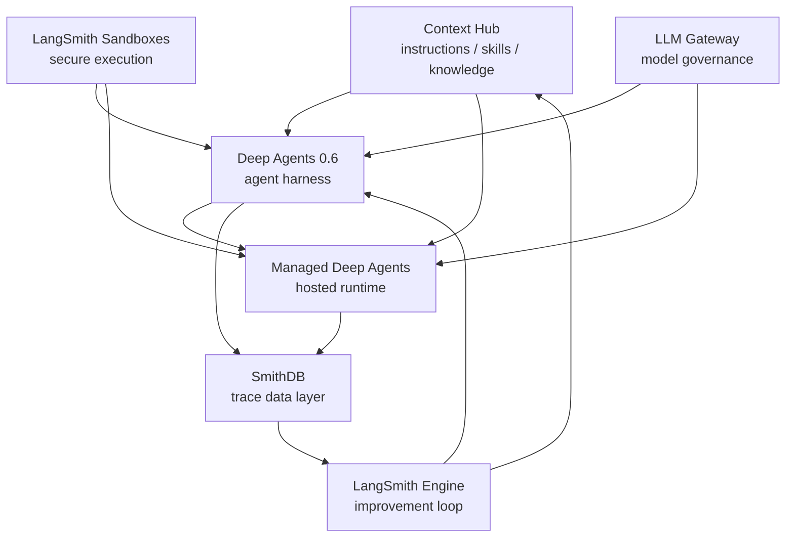

# LangChain Interrupt 2026 レポート

- 開催日: 2026年5月13日-14日
- 会場: The Midway, San Francisco
- 公式サイト: https://interrupt.langchain.com/
- 作成元: README、sessions配下のセッション要約・書き起こし、recap_0513配下のレポート配信書き起こし

## エグゼクティブサマリー

LangChain Interrupt 2026 は、AI agent の関心が「作れるか」から「本番でどう動かし、観測し、改善し続けるか」へ移ったことを強く示すイベントだった。Keynote で発表された LangSmith Engine、SmithDB、LangSmith Sandboxes、Managed Deep Agents、LLM Gateway、Context Hub、Deep Agents 0.6 は、個別の新機能というより、production agent のライフサイクルを丸ごと支えるスタックとして見ると理解しやすい。

中心にあるのは、agent はリリースして終わりではなく、trace、eval、feedback、memory、skills、tools を通じて育て続ける対象だという考え方である。通常のソフトウェアと比べて、agent はモデル、ツール、プロンプト、コンテキスト、外部環境の変化により挙動が簡単に変わる。そのため、本番投入後に何が起きたかを観測し、問題を発見し、修正し、再発を防ぐ継続的な仕組みが必要になる。

この観点から見ると、LangSmith は単なる observability ツールではなく、agent の開発・評価・運用・改善をつなぐ中核プロダクトへ進化している。SmithDB は大量で深い agent traces を扱うデータ基盤、LangSmith Engine は trace から改善アクションを作る仕組み、LangSmith Sandboxes は agent が安全にコードを実行する環境、LLM Gateway はモデル利用のコストと認証を統制する層として位置づけられる。

一方で、Deep Agents 0.6、Context Hub、Managed Deep Agents は、agent が実際に動くための harness、context、runtime を整備する側の発表だった。Deep Agents は長時間・複雑なタスクを扱うための agent harness であり、Context Hub は instructions、skills、knowledge を versioned context として管理する。Managed Deep Agents はそれらを production runtime として提供する方向性を示していた。

## 7つの発表をスタックとして見る

今回の発表は、以下のような役割分担で整理できる。

`Context Hub`、`LangSmith Sandboxes`、`LLM Gateway` は、agent に必要な context、実行環境、ガバナンスを提供する。`Deep Agents 0.6` はそれらを使って長時間・複雑なタスクを解く harness になり、`Managed Deep Agents` はその harness を production API / hosted runtime として扱う。実行結果は `SmithDB` に蓄積され、`LangSmith Engine` が traces から問題検出、診断、修正案、eval 生成へつなげる。改善結果は再び prompts、skills、context、agent code に戻る。

つまり、LangChain が示したのは agent platform の垂直統合ではなく、open / model-agnostic な harness と LangSmith を中心にした production loop である。OpenAI や Anthropic のような frontier model vendor が managed agent 体験を出していくなかで、LangChain は複数モデル・複数ツール・複数実行環境を束ねる vendor-neutral な運用基盤を目指している。

## リリーストピックの解説

### 1. LangSmith Engine

LangSmith Engine は、production traces から recurring issue を発見し、root cause を診断し、修正案、evaluator、dataset examples へつなげる改善ループである。`How We Built It` のセッションでは、最初の難所は「問題をたくさん見つけること」ではなく、「意味があり、修正可能な単位へ蒸留すること」だと説明されていた。

agent はモデルやツールの変更で簡単に挙動が変わる。開発者が常に全ての本番挙動を見続けることはできないため、Engine は production signal を読み、優先度の高い issue として提示し、必要なら GitHub PR や eval 作成へつなげる。これは agent に限らず、将来的には通常のソフトウェア開発にも広がりうる発想である。

### 2. SmithDB

SmithDB は、LangSmith の trace observability のために purpose-built されたデータ基盤として紹介された。agent traces は通常の logs / metrics と異なり、深くネストされ、payload が大きく、multi-turn / multimodal で、個別 step への random access や全文検索が必要になる。

Cisco セッションでは、weekly trace volume が 150 million を超える規模や、単一顧客が1日に 50 TB の trace data を送る例が語られた。SmithDB は object storage、compute / storage separation、cluster manager、Postgres metadata store、SSD / memory cache、file compaction / shaping service を組み合わせ、この workload に最適化されている。

実装面では Rust 製で、Apache DataFusion と Vortex を土台にしていると説明されていた。Apache DataFusion は Rust / Apache Arrow ベースの query engine であり、SmithDB はその上に trace search 向けの index、query planning、storage layout を足している。Andrew Lamb 氏の投稿でも、SmithDB が Apache DataFusion でできていることが確認されている。

### 3. LangSmith Sandboxes

LangSmith Sandboxes は、agent-generated code を安全に実行するための ephemeral で locked-down な環境である。agent がコードを書き、CLIを実行し、データを加工する場面では、local machine や production infrastructure に直接触らせるのは危険になる。そのため、filesystem、network、resource usage、実行可能 binary などを制御できる sandbox が必要になる。

Keynote では、1秒未満の起動、persistence、snapshot / restore、auth proxy などが紹介された。Managed Deep Agents の文脈では、ほぼ全ての agent がどこかで coding-agent 的な能力を必要とするため、LangSmith Sandboxes は execution environment として重要な構成要素になる。

### 4. Managed Deep Agents

Managed Deep Agents は、Deep Agents harness を production runtime として運用するための private beta として紹介された。Deep Agents harness、LangSmith Deployment、Context Hub integration、LangSmith Sandboxes、MCP tools、streaming protocol をまとめ、agent creation / update / invoke、horizontal scaling、durable checkpoint、resume / replay、human-in-the-loop を扱う。

セッションでは、agent は model + tools だけではなく、right context at the right time を与える harness が必要だと整理されていた。Deep Agents の主要能力は execution environment、context management、delegation、steering / human-in-the-loop の4つである。Managed Deep Agents は、これを本番で扱える単位にする。

### 5. LLM Gateway

LLM Gateway は、OpenRouter 的なモデルルーティングに加えて、cost visibility、spend limits、credential management、PII / secrets guardrails を担う層として議論されていた。配信内では、LangSmith を中心にモデル呼び出しのコストや認証を集中的に管理できる点が大きな意味を持つと話されている。

現時点では frontier model の API price が実質的に安く、何でも高性能な汎用モデルへ投げる選択が通りやすい。しかし、モデル価格がよりフェアレートへ近づいたり、特化モデル・open weight model との使い分けが増えたりすれば、Gateway の価値はより明確になる。モデルの retirement やバージョン更新に耐えるためにも、呼び出し先を抽象化し、統制できる層は重要になる。

### 6. Context Hub

Context Hub は、agent instructions、skills、knowledge、memory-like context を versioned bundle として管理する仕組みである。Keynote では、context は単なる prompt から、`AGENTS.md`、`SKILL.md`、社内 wiki のような markdown knowledge へ広がっていると説明された。

Context Hub は、local に pull して coding CLI で使う、Deep Agents の virtual filesystem として参照する、staging / production へ promote する、といった使い方を想定している。agent の品質は、モデルだけでなく「何を知って動くか」に強く依存するため、context を versioning し、差分確認や rollback を可能にすることは production agent にとって重要になる。

### 7. Deep Agents 0.6

Deep Agents 0.6 は、長時間・複雑なタスクを扱う agent harness の更新として位置づけられる。Keynote では open models、execution environment、streaming の強化が語られていた。QuickJS ベースの lightweight code interpreter、新しい streaming protocol、frontend SDK、CopilotKit / assistant-ui / Vercel などの UI framework との統合が紹介された。

配信では、AI agent の方向性が大きく2つに分かれてきているという議論もあった。1つは user experience を高めるチャットボット / copilot 型、もう1つは長時間実行して複雑なタスクを解く Deep Agents 型である。両者は必要な仕組みが異なるため、LangChain は UI ecosystem との連携を保ちながら、Deep Agents では長時間・複雑タスクの harness を深めている。

## セッション別の学び

### Keynote

Keynote は、agent development lifecycle の全体像と新機能発表が中心だった。agent は自然言語・画像・音声など巨大な入力空間を扱い、出力も非決定的であるため、従来の software development lifecycle とは異なる build / test / deploy / observe / improve のサイクルが必要になる。

発表された製品群は、このサイクルを支えるための部品として一貫していた。Deep Agents は harness、LangSmith Sandboxes は execution、Context Hub は context、LLM Gateway は governance、Managed Deep Agents は hosted runtime、SmithDB は data layer、LangSmith Engine は improvement loop である。

### Building Frontier CX Agents

このセッションでは SmithDB が詳しく説明された。agent observability の本質的な難しさは、trace が巨大で深く、構造化されているようで非定型でもあり、さらに検索・フィルタ・個別 step へのアクセスが必要になる点にある。従来のログ基盤では、agent traces の interactive な探索体験を維持しにくい。

SmithDB はそのための専用基盤であり、LangSmith Engine のような改善 loop の土台にもなる。agent を本番で動かすほど trace は増え、trace が増えるほど改善の材料も増える。SmithDB はこの flywheel を回すための基盤である。

### Scaling GTM Agents

Clay のセッションでは、GTM agents の価値は単なる email generation ではなく、market signal を読み、いつ誰にどの文脈で outreach すべきかを判断する点にあると説明された。資金調達、採用、公開情報、顧客データなどを横断して、playbook を改善していく世界観である。

運用面では、durable execution、checkpoint、failure recovery、provider throttle に応じた adaptive capacity management、prompt caching、online evaluation が重要になる。GTM workload は大量に並列化されるため、agent quality だけでなく、infrastructure reliability と cost strategy が成果に直結する。

### The Production System for Agents

Toyota のセッションは、enterprise agent を量産する platform approach と、Toyota Production System の考え方を agent 開発へ移植する視点が印象的だった。Toyota では、個別チームがばらばらに chatbot を作るのではなく、共通 platform、security / integration layer、MCP-compatible tool layer、enterprise skills library によって agent を構築する。

TPS の4概念は agent production によく対応する。`andon` は LangSmith observability による状態の見える化、`kaizen` は trace / eval に基づく継続改善、`jidoka` は human-in-the-loop を組み込んだ自働化、`genchi genbutsu` は production trace を見て根本原因を追う姿勢である。agent は作るよりも育てるものだという今回のイベント全体のメッセージと強く重なる。

### How Lyft Builds Evals That Actually Matter in Production

Lyft のセッションでは、customer care AI agents を安全に拡張するための eval system が紹介された。重要なのは、ユーザーをテストデータにしないこと。launch 前に simulator、mocked MCP data、synthetic user、rubric-based evaluator を使い、offline evaluation を品質ゲートにする。

評価は helpfulness のような曖昧な scalar score ではなく、agent が達成すべき task と失敗条件を明確にした rubric にする必要がある。LLM-as-judge も ML model と同じように human labels / domain expert labels で校正し、production feedback を eval improvement に戻す。

### Make Legal Write Your Evals

Chime のセッションでは、legal / compliance team と共同で evals を作る方法が紹介された。規制産業では agent の失敗は trust を壊すだけでなく regulator issue にもつながる。そのため compliance を kickoff と release gate だけに置くのではなく、evals を alignment surface として開発中に継続参加させる。

具体的には、risk を domain / category / concrete risk に分解し、legal team が prohibited content、legal basis、allowed alternatives、example questions を定義する。その structured risk definition から dataset と judge prompt を生成し、engineer、compliance、executive が同じ taxonomy で品質を見られるようにする。

### Introducing Managed Deep Agents

このセッションでは、Deep Agents harness と Managed Deep Agents の関係が整理された。agent harness は、model を real world へ接続し、right context at the right time を与える層である。execution environment、context management、delegation、steering / human-in-the-loop が主要能力として説明された。

特に subagents は isolated context で動き、main agent の context を汚さずに task を parallelize できる点が重要である。Managed Deep Agents は、この harness を LangSmith Deployment、Context Hub、LangSmith Sandboxes と組み合わせて production-ready にする取り組みとして位置づけられる。

### How We Built It

LangSmith Engine の構築セッションでは、production traces から issue / fix / eval / dataset をつなぐ self-healing loop が説明された。初期版は traces を coding agent に渡して PR を作る仕組みから始まったが、実際には問題ではないものまで見つけすぎる課題があった。

そのため、Engine の設計では issue identification、prioritization、actionability が重要になる。顧客ごとに重要な issue は異なるため、feedback や memory file 的な preferences も必要になる。さらに Engine 自体も eval-driven に改善され、将来的には Engine が Engine を改善する loop も見えている。

## レポート配信で語られた内容

recap 配信では、現地参加者視点の雰囲気と、Keynote 発表をどう理解するかが中心に語られた。会場は昨年と同じ The Midway で、参加者数は体感で昨年の約1.5倍、LangChain グッズを身につけた参加者も多く、Harrison Chase が登場すると強い歓声が起きるほどエンゲージメントが高かったという。

日本から見る LangChain と、米国現地の LangChain community には温度差があるという指摘もあった。日本では hyperscaler や既存クラウドの文脈でAI基盤を見ることが多いが、現地では LangChain 自体に fandom 的な熱量があり、ambassador network も活発に機能している。

ambassador meeting では、LangChain が vertical / solution にどこまで深く入るのか、FDE 的な動きをどう考えるのかが話題になった。FDE については、AI agent の開発・運用ケイパビリティを自社に持つ企業と、持たない企業に分かれていくという見立てが共有された。Non-AI な企業に agent を導入する場合、ユースケース発見、workflow 設計、eval / observability / deployment の運用設計まで伴走する FDE 的役割は必要になる。一方で、LangChain がそれを大々的な採用方針にするかは、まだ決めかねているという印象だった。

配信では、LangSmith 系の3発表を「Dev から production へ friction 少なく持っていき、その後も運用し続けるための投資」と整理していた。特に LangSmith Engine については、agent はリリースした瞬間からモデルやツールやユーザー行動の変化で劣化しうるため、人間の attention が離れても drift を検知し、改善し続ける仕組みが必要になると議論された。

また、agent は「開発するもの」ではなく「育てるもの」だという表現が印象的だった。最初の種は coding agent で素早く作れるようになってきたが、本当に大きい仕事は、リリース後に experience learning を回し、trace と eval を使って現実の業務に fit させていくことにある。

Deep Agents については、agent のパラダイムが2つに分かれつつあるという議論があった。1つはユーザー体験を高める copilot / chatbot 型、もう1つは長時間実行して複雑なタスクを解く Deep Agents 型である。必要な実装や評価の仕組みが異なるため、両者を分けて設計する必要がある。

さらに、harness と model の関係についても議論された。現在 harness が担っている機能は、将来的に model 側に吸収されるかもしれない。ただし、現時点でエンジニアが日々の問題を解くには、今ある harness、runtime、observability、eval の仕組みを理解し、使いこなす必要がある。今キャッチアップする意味は、概念が物理的な仕組みに落ち、さらに抽象化されていく過程を見られることにある。

## このイベントからの示唆

第一に、production agent に必要なのは prompt engineering だけではない。必要なのは、context、tools、sandbox、auth、gateway、trace storage、eval、feedback loop を含む operating system である。LangChain / LangSmith は、その部品を一気に揃えにきている。

第二に、agent の品質管理は offline eval と production trace の往復になる。Lyft や Chime の話が示すように、launch 前の simulator / rubric / legal-defined risk と、launch 後の trace / annotation / Engine による改善は両方必要である。

第三に、enterprise adoption では FDE 的な能力が重要になる。Non-AI な企業にとって、agent platform を渡されるだけでは成果に届きにくい。ユースケースを切り出し、小さくリリースし、振り返り、改善するケイパビリティをどう移管するかが実装以上に大きい。

第四に、agent infrastructure の方向性は収斂してきている。sandbox、gateway、managed runtime、context store、memory、filesystem-like interface、observability、eval loop は各社が似た方向に進んでいる。LangChain の差別化は、model-agnostic で open source の harness と、LangSmith の production loop を組み合わせられる点にある。

最後に、AI agent の開発は、通常のソフトウェア開発そのものも変えうる。LangSmith Engine がやろうとしている「意味のある issue を見つけ、actionable な単位に落とし、修正し、eval を追加する」という loop は、agent だけでなくソフトウェア全般の改善プロセスにも適用できる。Interrupt 2026 は、agent のイベントであると同時に、これからの software production system のイベントでもあった。

## 参考ファイル

- [README.md](README.md)
- [recap_0513/recap_0513_tldv_transcript.txt](recap_0513/recap_0513_tldv_transcript.txt)
- [sessions/day1-keynote.md](sessions/day1-keynote.md)
- [sessions/building-frontier-cx-agents.md](sessions/building-frontier-cx-agents.md)
- [sessions/scaling-gtm-agents.md](sessions/scaling-gtm-agents.md)
- [sessions/the-production-system-for-agents.md](sessions/the-production-system-for-agents.md)
- [sessions/how-lyft-builds-evals-that-actually-matter.md](sessions/how-lyft-builds-evals-that-actually-matter.md)
- [sessions/make-legal-write-your-evals.md](sessions/make-legal-write-your-evals.md)
- [sessions/introducing-managed-deep-agents.md](sessions/introducing-managed-deep-agents.md)
- [sessions/how-we-built-it.md](sessions/how-we-built-it.md)
