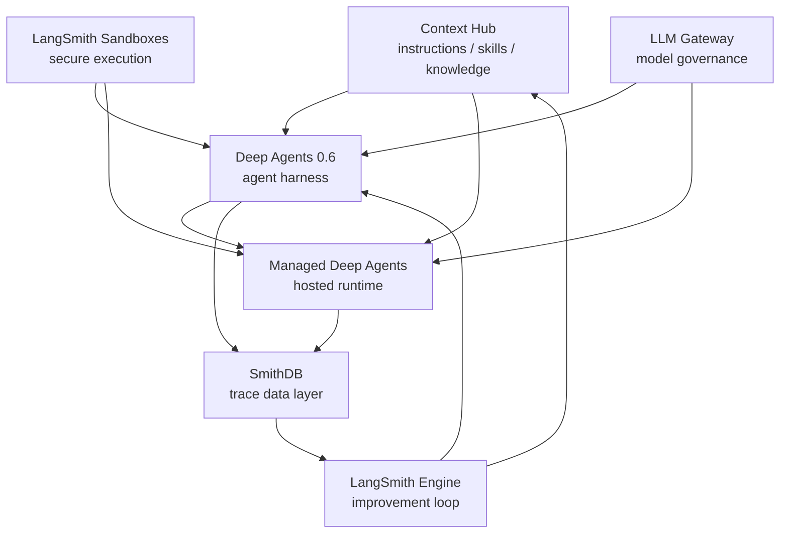

# AIエージェントは「作る」から「育てる」へ: LangChain Interrupt 2026 現地レポート

2026年5月13日から14日にかけて、San Francisco の The Midway で LangChain 主催の agent conference「[Interrupt 2026](https://interrupt.langchain.com/)」が開催された。昨年に続く2回目の開催で、今年は公式サイト上でも 1,000人以上の practitioners が参加するイベントとして案内されていた。

今回の Interrupt 2026 を一言でまとめるなら、AIエージェントの関心が「どう作るか」から「本番でどう動かし、観測し、改善し続けるか」へ移ったイベントだった。

エージェントは、いまや model と tools をつなげればデモが作れる段階にある。けれど、本番に出した瞬間から問題は一気に増える。ユーザーは想定外の入力をする。モデルは更新される。ツールの挙動も変わる。プロンプトやスキルを少し変えただけで、以前できていたことができなくなることもある。

つまり、AIエージェントは「完成品としてリリースするもの」というより、「リリース後に育て続けるもの」になっている。今回発表された LangSmith Engine、SmithDB、LangSmith Sandboxes、Managed Deep Agents、LLM Gateway、Context Hub、Deep Agents 0.6 は、まさにそのためのスタックだった。

## 今年の主役は LangSmith だった

LangChain という名前からは、どうしても framework や agent harness の会社という印象を持ちやすい。しかし、今回の発表を見ていて強く感じたのは、LangChain がかなり明確に LangSmith を production agent の中核に据えているということだ。

LangSmith はもはや単なる observability ツールではない。agent の traces を集め、eval を回し、問題を見つけ、修正案を作り、再発防止の evaluator や dataset examples までつなげる。開発、評価、運用、改善をつなぐ production loop の中心になろうとしている。

この流れを支えるために、LangSmith 側では大きく3つの発表があった。

1つ目は `LangSmith Engine`。production traces から繰り返し発生する問題を見つけ、原因を診断し、修正案や eval までつなげる仕組みである。`How We Built It` のセッションでは、単に問題を大量に見つけるのではなく、「意味があり、修正可能な単位」に蒸留することが重要だと説明されていた。

2つ目は `SmithDB`。LangSmith の trace observability を支える新しいデータ基盤である。agent traces は通常の logs / metrics と違い、深くネストされ、payload が大きく、multi-turn / multimodal で、個別 step への random access や全文検索も必要になる。Cisco セッションでは、weekly trace volume が 150 million を超える規模や、単一顧客が1日に 50 TB の trace data を送った例も語られていた。

3つ目は `LangSmith Sandboxes`。agent が生成したコードを安全に実行するための隔離環境だ。agent が code を書き、CLI を実行し、データを加工するようになるほど、local machine や production infrastructure に直接触らせるわけにはいかない。そこで、filesystem、network、resource usage、credential exposure を制御できる sandbox が必要になる。

この3つは、それぞれ「観測する」「蓄積する」「安全に実行する」という役割を持つ。合わせて見ると、LangSmith が production agent の運用基盤としてかなり本気で作られていることが分かる。

## 7つの発表は1つのスタックとして見ると分かりやすい

Keynote では、主に以下の7つがリリーストピックとして扱われていた。

1. LangSmith Engine
2. SmithDB
3. LangSmith Sandboxes
4. Managed Deep Agents
5. LLM Gateway
6. Context Hub
7. Deep Agents 0.6

これらは個別機能として見るよりも、production agent を作り、動かし、観測し、改善するためのスタックとして見る方が理解しやすい。

`Context Hub` は agent が読む instructions、skills、knowledge を管理する。`LangSmith Sandboxes` は agent が安全に code を実行する場所を提供する。`LLM Gateway` は model 呼び出しの cost、auth、routing、PII / secrets guardrails を担う。

その上で、`Deep Agents 0.6` が長時間・複雑なタスクを扱う agent harness になる。`Managed Deep Agents` は、その harness を production API / hosted runtime として動かすための仕組みだ。

実行結果は `SmithDB` に蓄積され、`LangSmith Engine` が traces から問題検出、診断、修正案、eval 生成へつなげる。そして改善結果は、prompts、skills、context、agent code に戻っていく。

つまり、LangChain が今回示したのは、単なる agent framework の拡張ではない。エージェントの production lifecycle 全体を回すための platform である。

## Deep Agents は「長時間・複雑タスク」のための harness へ

今回のもう1つの軸は Deep Agents だった。

Deep Agents は、長時間・複雑なタスクを扱うための agent harness である。`Introducing Managed Deep Agents` のセッションでは、agent は model + tools だけではなく、model を real world に接続し、right context at the right time を与える harness が必要だと説明されていた。

Deep Agents の主要能力は、大きく4つに整理されていた。

- execution environment
- context management
- delegation
- steering / human-in-the-loop

execution environment は、filesystem や code interpreter、sandbox のように、agent が scratch file を書き、code を実行し、動的に問題を解ける環境である。context management は、summarization、context offloading、prompt caching、skills、short / long-term memory などを使い、long-running agent の context overflow を防ぐ。

delegation では subagents が重要になる。subagents は isolated context で動くため、main agent の context を汚さずにタスクを並列化できる。steering / human-in-the-loop は、approval、edit、reject、clarification といった人間の判断を workflow の中に組み込む仕組みである。

Deep Agents 0.6 では、open models、execution environment、streaming の強化が語られていた。QuickJS ベースの lightweight code interpreter、新しい streaming protocol、frontend SDK、CopilotKit / assistant-ui / Vercel などの UI framework との統合も紹介された。

配信中の議論で面白かったのは、AIエージェントのパラダイムが大きく2つに分かれつつあるという見立てだ。1つは、ユーザー体験を高める copilot / chatbot 型。もう1つは、長時間実行して複雑なタスクを解く Deep Agents 型である。この2つは必要な実装も評価も違う。LangChain は UI ecosystem との連携を保ちながら、Deep Agents では後者の harness を深めているように見えた。

## SmithDB は agent traces のためのデータ基盤

SmithDB は今回の発表の中でも特に技術的に面白いトピックだった。

agent traces は普通のログとはかなり違う。1つの trace の中に大量の intermediate steps があり、tool calls があり、messages があり、場合によっては画像や音声のような multimodal payload も含まれる。しかも、後から「この1回の実行で何が起きたか」を細かく見たいこともあれば、「数百万件の traces の中で似た失敗がどれだけ起きているか」を検索したいこともある。

この workload は、従来の logs / metrics の基盤だけでは扱いにくい。そこで LangSmith は SmithDB を作った。

Cisco セッションでは、SmithDB が object storage、compute / storage separation、cluster manager、Postgres metadata store、SSD / memory cache、file compaction / shaping service を組み合わせていると説明されていた。trace 内の個別 step への random access、full-text search、thread navigation、metadata / tag / time filtering など、agent observability に特化した access pattern に最適化している。

実装面では Rust 製で、Apache DataFusion と Vortex を土台にしている。Apache DataFusion は Rust / Apache Arrow ベースの query engine であり、SmithDB はその上に trace search 向けの indexing、custom query planning、execution plans、storage layout を追加している。Andrew Lamb 氏の X 投稿でも、SmithDB が Apache DataFusion でできていることが宣言されていた。

SmithDB が重要なのは、単に LangSmith の画面が速くなるからではない。LangSmith Engine のような改善 loop は、大量の production traces を入力にする。つまり、agent を本番で育てるには、まず traces をちゃんと蓄積し、検索し、比較し、分析できる必要がある。SmithDB はその土台である。

## Toyota、Lyft、Chime が示した production agent の現実

今回のセッション群で印象的だったのは、どの事例も「agent をどう作ったか」だけでは終わらなかったことだ。むしろ、どう運用し、どう評価し、どう組織に組み込むかが中心だった。

Toyota の `The Production System for Agents` は、その象徴だった。Toyota では、個別チームがばらばらに chatbot を作るのではなく、共通 platform、security / integration layer、MCP-compatible tool layer、enterprise skills library によって agent を構築する。初期には1つの agent 構築に6人の engineer と6か月が必要だったが、platform 化により4日程度で構築できるようになったと説明されていた。

このセッションでは、Toyota Production System の4概念が agent 開発に対応づけられていた。

- `andon`: LangSmith observability による状態の見える化
- `kaizen`: trace / eval に基づく継続改善
- `jidoka`: human-in-the-loop を組み込んだ自働化
- `genchi genbutsu`: production trace を見て根本原因を追う姿勢

特に `genchi genbutsu` と traces の対応は分かりやすい。agent の失敗は final answer だけ見ても原因が分からない。どの tool call が失敗したのか、どの intermediate step で方針がずれたのか、どの context が足りなかったのかを trace で見に行く必要がある。

Lyft のセッションでは、customer care AI agents を安全に拡張するための eval system が紹介された。重要なのは、ユーザーをテストデータにしないこと。launch 前に simulator、mocked MCP data、synthetic user、rubric-based evaluator を使い、offline evaluation を品質ゲートにする。helpfulness のような曖昧な scalar score ではなく、agent が達成すべき task と失敗条件を明確にした rubric にする必要がある、という話も印象的だった。

Chime の `Make Legal Write Your Evals` では、legal / compliance team と共同で evals を作る方法が紹介された。規制産業では、agent の失敗は trust を壊すだけでなく regulator issue にもつながる。そこで、legal / compliance を kickoff と release gate だけに置くのではなく、evals を alignment surface として開発中に継続参加させる。

具体的には、risk を domain / category / concrete risk に分解し、legal team が prohibited content、legal basis、allowed alternatives、example questions を定義する。その structured risk definition から dataset と judge prompt を生成し、engineer、compliance、executive が同じ taxonomy で品質を見られるようにする。

これらの事例はどれも、agent の本番運用が software engineering、platform engineering、ML evaluation、domain governance の交差点にあることを示していた。

## 現地の熱量と、LangChain community の温度感

recap 配信では、現地参加者の視点から会場の雰囲気も話した。

会場は昨年と同じ The Midway。現地の体感では参加者数は昨年の約1.5倍で、LangChain グッズを身につけた参加者もかなり多かった。Harrison Chase が登場すると歓声が上がるほどで、LangChain community のエンゲージメントの高さが印象的だった。

日本から見ている LangChain と、米国現地の LangChain community には少し温度差がある。日本では hyperscaler や既存クラウドの文脈でAI基盤を見ることが多い。一方で、現地では LangChain 自体に fandom 的な熱量があり、ambassador network も活発に機能している。

ambassador meeting では、LangChain が vertical / solution にどこまで深く入るのか、FDE 的な動きをどう考えるのかも話題になった。

FDE については、AI agent の開発・運用ケイパビリティを自社に持つ企業と、持たない企業に分かれていくという見立てがある。Non-AI な企業に agent を導入する場合、ユースケース発見、workflow 設計、eval / observability / deployment の運用設計まで伴走する FDE 的役割は必要になる。一方で、LangChain がそれを大々的な採用方針にするかは、まだ決めかねているようにも見えた。

この点は、LangChain の今後の go-to-market を考える上でも重要だと思う。プロダクトを渡せば使える企業と、導入・運用の capability transfer まで必要な企業では、必要な支援がまったく違うからだ。

## 「作った後」が本番になる

今回のイベントを通して、何度も頭に浮かんだのは「作った後が本番」ということだった。

AIエージェントは、最初の prototype を作るだけなら驚くほど簡単になっている。coding agent を使えば、agent の種はかなり速く作れる。けれど、そこから業務に fit させ、モデルやツールの変化に追従し、失敗を検知し、評価を増やし、改善し続ける部分はまだ重い。

recap 配信では、この話を「agent は開発するものではなく育てるもの」と表現した。最初の release はゴールではなく、経験学習のスタート地点である。小さく出し、trace を見て、eval を足し、また直す。その cadence をどれだけ上げられるかが、production agent の勝負になる。

これは通常のソフトウェアとも少し違う。もちろんソフトウェアも継続改善する。しかし agent の場合、モデルの更新、tool selection、prompt、memory、context、外部APIの変化が複雑に絡み、挙動の drift が起きやすい。担当エンジニアが別のプロジェクトに移った後でも、agent は本番で動き続ける。だから、人間の attention が離れても問題を検知し、改善につなげる仕組みが必要になる。

LangSmith Engine は、その方向にかなり踏み込んだ発表だった。production traces から意味のある issue を見つけ、actionable な単位に落とし、修正し、eval を追加する。この loop は、agent だけでなく通常のソフトウェア開発にも広がりうる。

## harness はいつか model に吸収されるのか

もう1つ面白かった議論は、harness と model の関係である。

現在、Deep Agents のような harness は、planning、filesystem、subagents、skills、memory、code execution など、モデル単体では足りない機能を補っている。しかし、モデルが進化すれば、いま harness が担っている機能の一部は model 側に吸収されるかもしれない。

これは十分ありうる。ただし、だからといって今 harness を学ぶ意味がないわけではない。むしろ、今は概念が物理的な仕組みに落ち、さらに抽象化されていく過程を見られる貴重な時期だと思う。

将来、frontier model 側に多くの機能が統合されるとしても、現時点で本番の問題を解くには、harness、runtime、observability、eval、sandbox、gateway を理解して使う必要がある。今キャッチアップする意味は、単にツール名を覚えることではなく、production agent に必要な部品がどのように分解され、再構成されていくかを見ることにある。

## まとめ

Interrupt 2026 は、agent framework のイベントというより、これからの software production system のイベントだった。

production agent に必要なのは、prompt engineering だけではない。context、tools、sandbox、auth、gateway、trace storage、eval、feedback loop を含む operating system が必要になる。LangChain / LangSmith は、その部品を一気に揃えにきている。

Lyft や Chime の事例は、offline eval と production trace の往復が品質管理の中心になることを示していた。Toyota の事例は、enterprise agent を量産するには platform と共通の production system が必要であることを示していた。LangSmith Engine と SmithDB は、そのすべてを支える改善 loop と data layer として位置づけられる。

AIエージェントは、作って終わりではない。作った後に観測し、評価し、直し、また出す。その loop をどう設計するかが、次の主戦場になる。Interrupt 2026 は、その方向転換をかなりはっきり見せてくれたイベントだった。

## 参考

- [Interrupt 2026 公式サイト](https://interrupt.langchain.com/)
- [README.md](README.md)
- [recap_0513/recap_0513_tldv_transcript.txt](recap_0513/recap_0513_tldv_transcript.txt)
- [sessions/day1-keynote.md](sessions/day1-keynote.md)
- [sessions/building-frontier-cx-agents.md](sessions/building-frontier-cx-agents.md)
- [sessions/scaling-gtm-agents.md](sessions/scaling-gtm-agents.md)
- [sessions/the-production-system-for-agents.md](sessions/the-production-system-for-agents.md)
- [sessions/how-lyft-builds-evals-that-actually-matter.md](sessions/how-lyft-builds-evals-that-actually-matter.md)
- [sessions/make-legal-write-your-evals.md](sessions/make-legal-write-your-evals.md)
- [sessions/introducing-managed-deep-agents.md](sessions/introducing-managed-deep-agents.md)
- [sessions/how-we-built-it.md](sessions/how-we-built-it.md)
