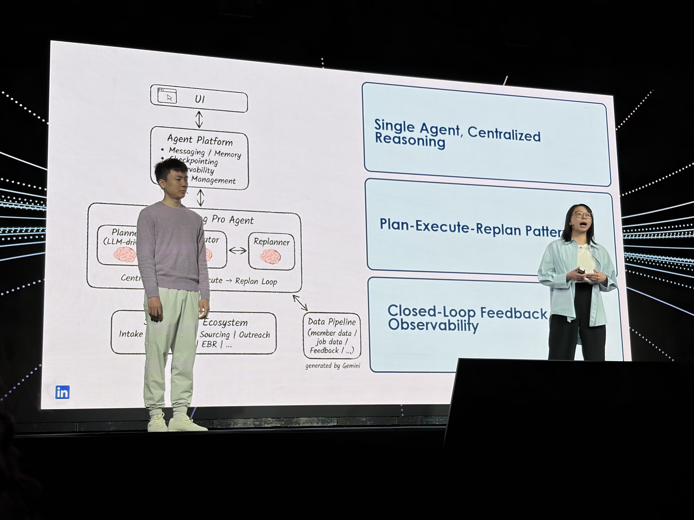

# 60% Faster Time-to-Interview: Transforming Hiring with AI Agents with LangChain

- 日付: 2026年5月14日
- 時間: 11:10 AM-11:30 AM
- 登壇者: Shang Liu, Tracy He
- 音声: [60_ Faster Time-to-Interview.m4a](60_%20Faster%20Time-to-Interview.m4a)
- 文字起こし: [60_ Faster Time-to-Interview_original.txt](60_%20Faster%20Time-to-Interview_original.txt)

## 写真

*11:12 PDT 頃。60% Faster Time-to-Interview セッション中の写真。*

## 要約

このセッションは、採用プロセスに agent を組み込み、time-to-interview を短縮する取り組みについての事例だった。自動書き起こしにはノイズが多いが、主題としては hiring manager が job description、requirements、candidate review、outreach、feedback を繰り返すプロセスを agentic workflow として扱い、候補者対応の速度を上げることが語られていた。

採用では、単発の生成だけでは不十分である。job description を作る、応募者を評価する、条件に合う候補者を探す、返信やフィードバックをもとに条件を修正する、といった複数ステップの loop がある。セッションでは、agent が requirements を集め、job instructions を生成し、候補者 sourcing や outreach を支援し、human feedback を受けながら調整する構成が示されていた。

技術的には、sequential workflow だけではなく、状態を保持しながら必要な判断を挟む LangGraph 的な graph workflow が重要になる。会話の途中で hiring manager が方向転換したり、条件を修正したりするため、最小限の状態を永続化し、次のメッセージで適切に再開できることが重要なポイントとして扱われていた。

## 重要ポイント

- hiring は、job description 生成だけでなく、requirements refinement、candidate sourcing、outreach、feedback loop を含む agent problem。
- agent は hiring manager の期待値に合わせて、候補者条件や outreach 方針を継続的に調整する必要がある。
- 会話の途中でユーザーが別方向へ進むため、状態管理と再開可能性が重要。
- LangGraph 的な graph workflow は、採用のような分岐・確認・再実行が多い業務に向いている。
- evaluation と human annotation を使って、agent の判断品質を継続的に改善する。
