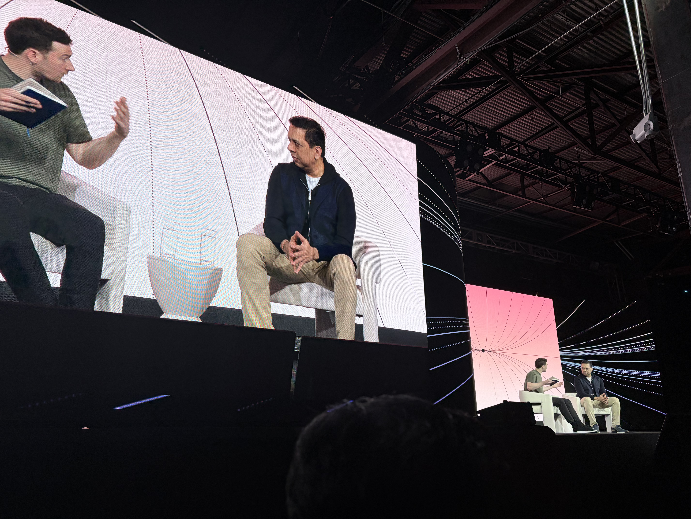

# Agents in the Enterprise

- 日付: 2026年5月14日
- 時間: 1:30 PM-2:00 PM
- 登壇者: Chirantan (CJ) Desai, Harrison Chase
- 音声: [Agents in the Enterprise.m4a](Agents%20in%20the%20Enterprise.m4a)
- 文字起こし: [Agents in the Enterprise_original.txt](Agents%20in%20the%20Enterprise_original.txt)

## 写真

*13:34 PDT 頃。Chirantan (CJ) Desai 氏と Harrison Chase 氏の fireside chat。*

## 要約

この fireside chat は、MongoDB の Chirantan (CJ) Desai と Harrison Chase による enterprise adoption の議論だった。MongoDB は open source database company としての出自、document model、scale-out architecture、unstructured data、native search / vector search といった特徴を持ち、AI時代の data layer として agentic applications と相性がよい、という話から始まった。

議論では、AI labs、AI-native startups、large enterprises がそれぞれ異なる形で data infrastructure を使っていることが整理された。labs は research / training data、voice、long-term memory などに使い、startups は高速に production agents を構築するための基盤として使う。enterprise では regulated workflows、payments、insurance、Adobe のような customer experience applications など、既存の大規模システムと統合する文脈が強い。

LangChain / LangSmith との関係では、vector search、hybrid search、long-term memory store、Graph RAG などの integration が、トップダウンの提携というより developer demand から始まった bottom-up な統合として語られていた。CJ は、model、hyperscaler、data layer、agent harness を固定しすぎない open ecosystem の重要性にも触れていた。

enterprise adoption の壁としては、選択肢が多すぎること、技術の変化が速いこと、規制・governance・security・explainability が重いことが挙げられた。employee-facing agents は比較的進みやすい一方、customer-facing agents は、保険や金融のように高リスクな判断が絡むため、confidence と governance が特に重要になる。

## 重要ポイント

- enterprise AI では、agent harness だけでなく data layer、search、memory、governance が重要。
- MongoDB 側から見ると、unstructured data と native search / vector search が agent applications の基盤になる。
- LangChain / MongoDB integration は、developer demand から始まった bottom-up なもの。
- employee-facing、partner-facing、customer-facing で agent の難易度とリスクは異なる。
- customer-facing agents では、regulation、security、governance、explainability が adoption の大きな壁になる。
- enterprise には optionality と happy path の両方が必要。
