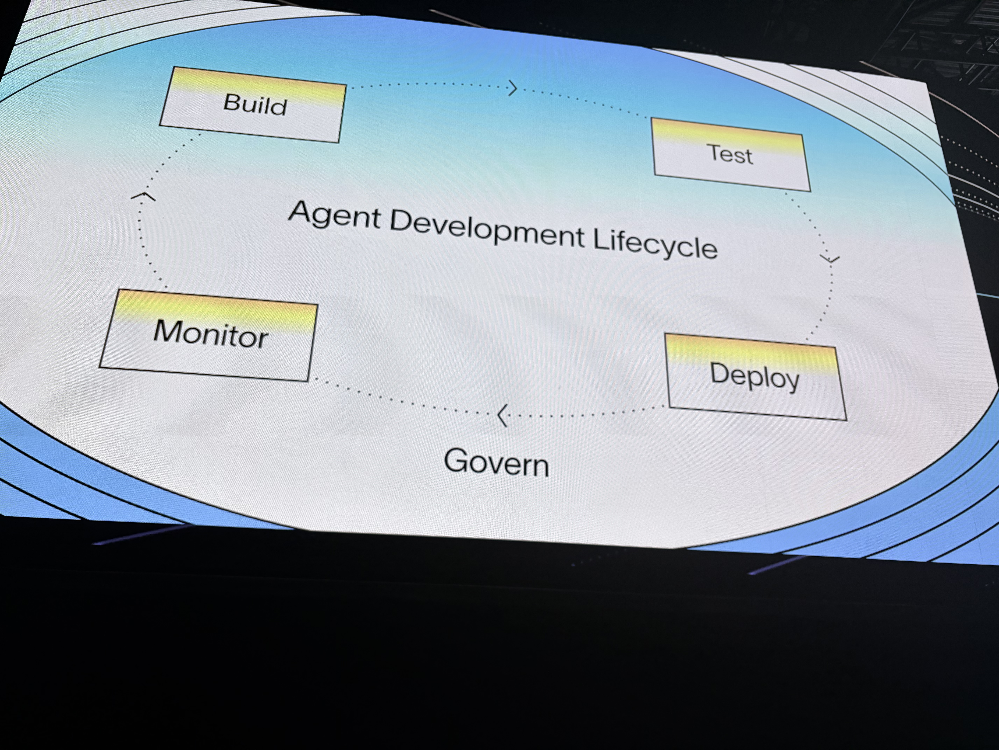
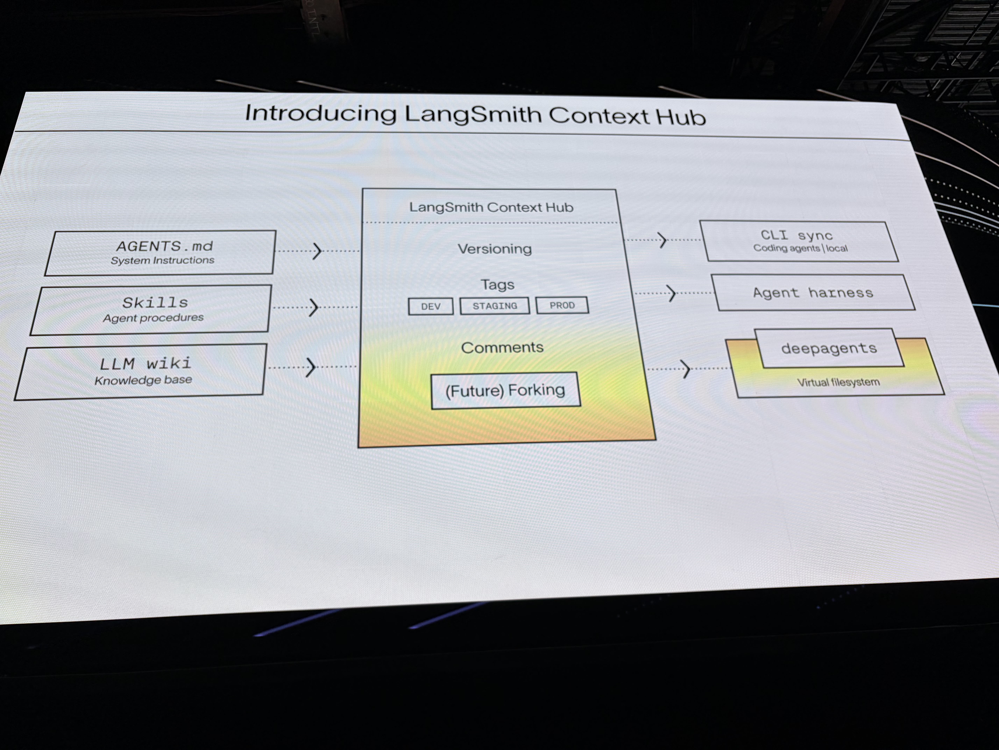
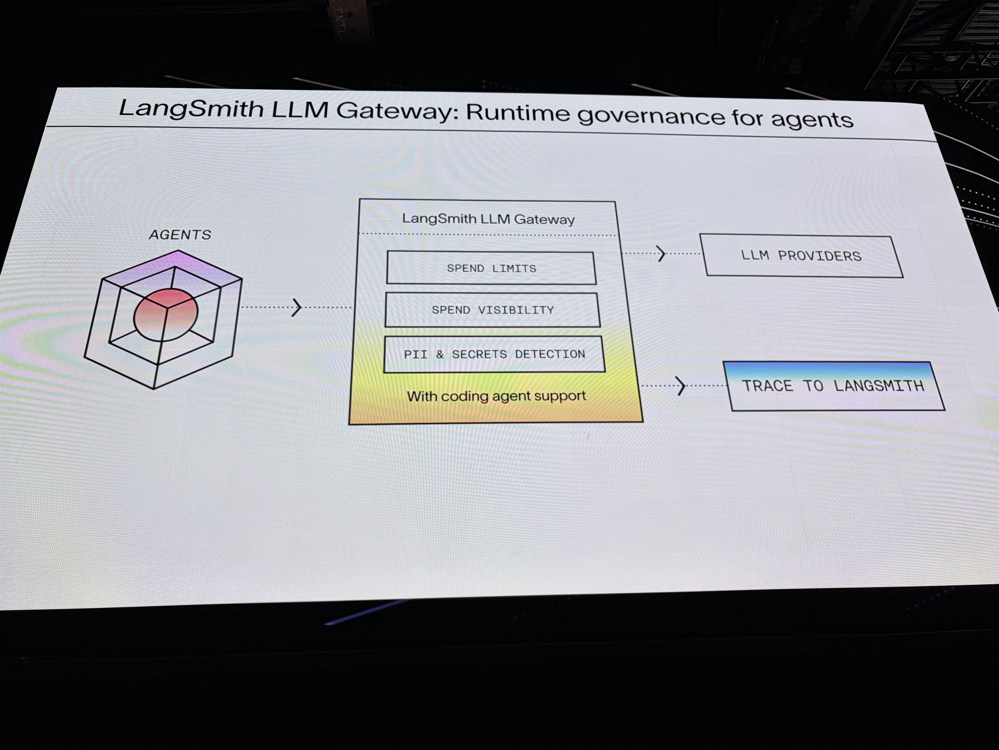
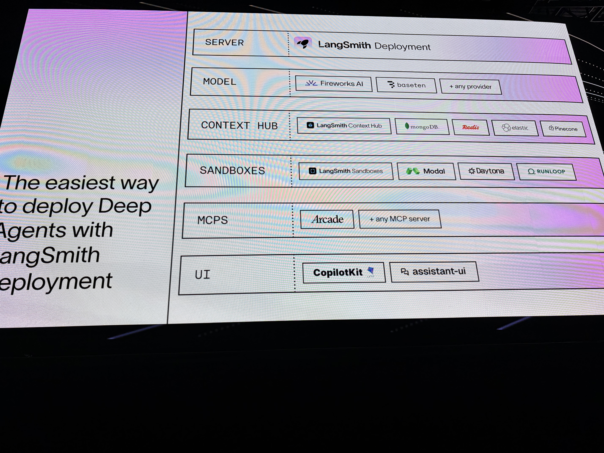
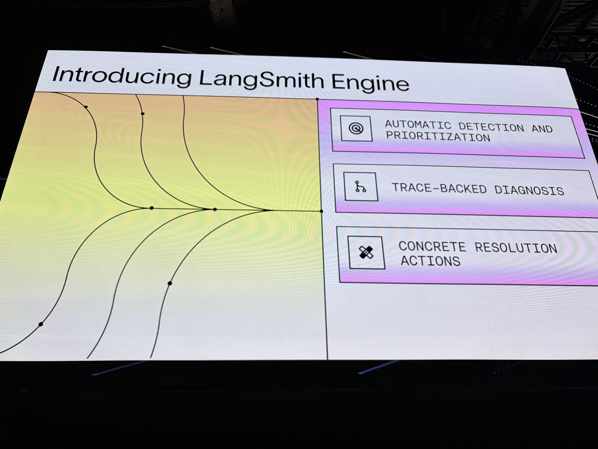

# Keynote

- 日付: 2026年5月13日
- 時間: 9:30 AM-10:30 AM
- 登壇者: Harrison Chase, Ankush Gola
- 音声: [Day1 keynote.m4a](Day1%20keynote.m4a)
- 文字起こし: [Day1 keynote_original.txt](Day1%20keynote_original.txt)

## 写真

*09:45 PDT 頃。Agent Development Lifecycle のスライド。*

*09:58 PDT 頃。Keynote 中の発表スライド。*

*10:01 PDT 頃。Keynote 中の発表スライド。*

*10:02 PDT 頃。Keynote 中の発表スライド。*

*10:21 PDT 頃。LangSmith Engine の紹介。*

## 要約

Day 1 keynote は、LangChain が考える agent development lifecycle の全体像と、それを支える新機能群の発表が中心だった。Harrison Chase は、agent は自然言語・画像・音声など巨大な入力空間を扱い、出力も非決定的であるため、従来の software development lifecycle とは異なる反復サイクルが必要だと説明した。

発表の中核は Deep Agents 0.6、LangSmith Sandboxes、LangSmith Context Hub、LLM Gateway、Managed Deep Agents、LangSmith Engine。Deep Agents 0.6 では open models の利用、QuickJS ベースの lightweight code interpreter、streaming protocol と frontend SDK の強化が紹介された。LangSmith Sandboxes は 1 秒未満で起動でき、persistence、snapshot / restore、auth proxy を備える実行環境として一般提供が発表された。

Context Hub は、prompts から `AGENTS.md` や skills、社内 wiki のような markdown knowledge へ広がった agent context を versioning / tagging / comments つきで管理する仕組みとして紹介された。LLM Gateway は agent と LLM call の間に入り、spend limits、cost visibility、PII / secrets guardrails、automatic tracing を提供するものとして説明された。

最後に Managed Deep Agents は、Deep Agents harness、LangSmith Deployments、Context Hub、LangSmith Sandboxes、MCP tools、streaming protocol を単一の production 向け API としてまとめる private preview として発表された。

## 重要ポイント

- agents は「build / test / deploy / observe / improve」を高速に回すための独自 lifecycle が必要。
- Deep Agents 0.6 は open models、code interpreter、streaming を強化。
- LangSmith Sandboxes は agent の code execution を production で扱うための基盤として GA。
- Context Hub は agent instructions / skills / memory-like context の version-controlled store。
- LLM Gateway は cost governance と data exposure control を担う。
- Managed Deep Agents は複数の LangChain / LangSmith 機能を production agent API として統合する。
