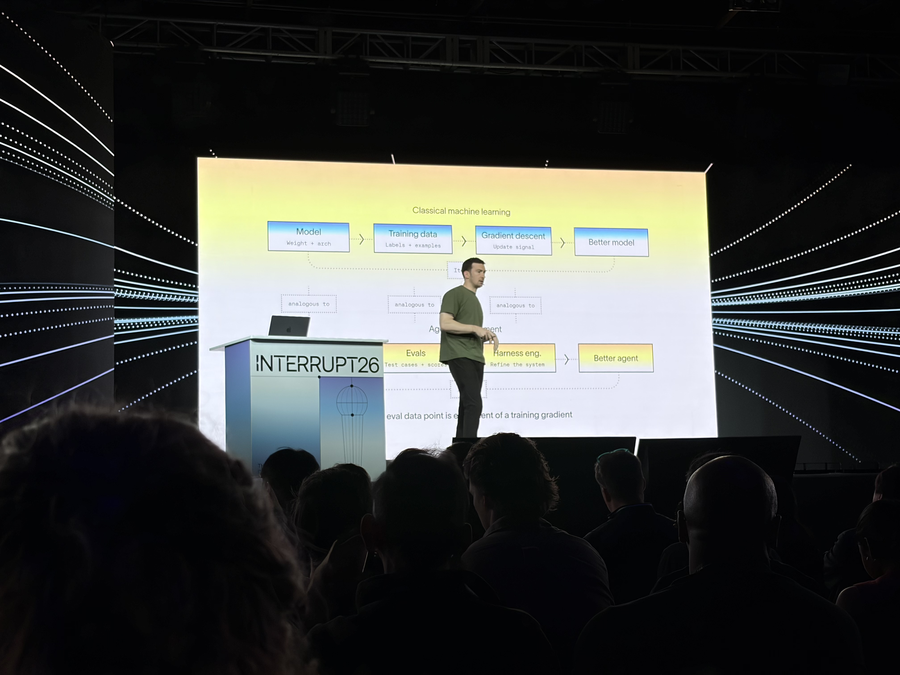
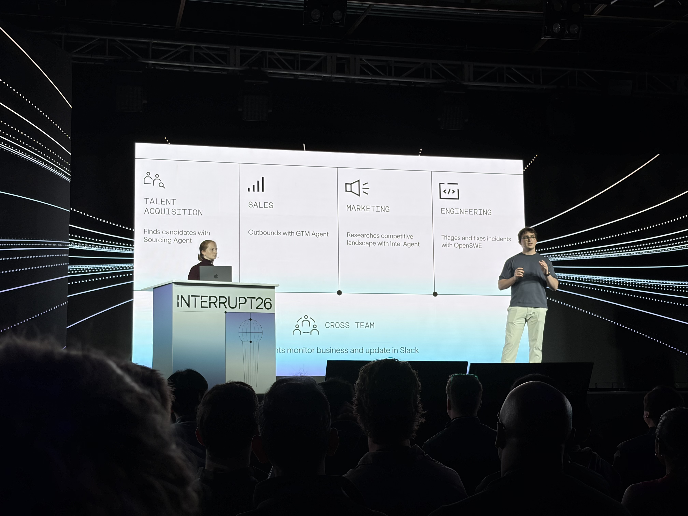

# Keynote

- 日付: 2026年5月14日
- 時間: 9:30 AM-10:00 AM
- 登壇者: Harrison Chase, Brace Sproul, Caroline di Vittorio
- 音声: [Day2 keynote.m4a](Day2%20keynote.m4a), [Day2 keynote 2.m4a](Day2%20keynote%202.m4a)
- 文字起こし: [Day2 keynote_original.txt](Day2%20keynote_original.txt), [Day2 keynote 2_original.txt](Day2%20keynote%202_original.txt)

## 写真

*09:46 PDT 頃。classical machine learning と agent development lifecycle の比較。*

*09:49 PDT 頃。Day 2 Keynote 中の発表スライド。*

## 要約

Day 2 keynote は、Interrupt 2027 でどのような論点が中心になるかを先取りする形で、agent の今後の方向性を整理する内容だった。Harrison Chase は、agent が大きく2つの方向へ分岐していくと説明した。1つは、分単位・時間単位、将来的には日単位で動く long-horizon agents。もう1つは、customer support や sales のように latency、brand experience、voice interface が重要になる customer experience agents である。

long-horizon agents では、planning、code execution、subagents、skills、sandbox が重要になる。特に、agent が code を書けることは software engineering だけでなく、data analysis、web browsing、image generation、deep research などに広がるため、LangSmith Sandboxes のような安全な実行環境が基盤になる。

また、open models、agent identity、continual learning も重要なテーマとして扱われた。open models は frontier model に近づきつつあり、cost と domain-specific post-training の観点から採用が増える可能性がある。agent identity については、user credentials で動く agent と、固定された service account / agent account で動く agent の両方が残り、用途ごとの使い分けが重要になる。

continual learning では、改善対象を model、harness、context の3層に分けて説明していた。LangSmith に蓄積される traces と evals は、model fine-tuning だけでなく、harness や context を改善するための学習信号にもなる。この文脈で、LangChain Labs という research group の発表も行われた。

後半では、非エンジニアを含む domain expert が agent を作り、運用し、改善に関与していく未来も示された。agent は instructions、skills、tools、memory の集合であり、その業務を実際に知っている人が agent を作ることの重要性が強調された。

## 重要ポイント

- agent は long-horizon agents と customer experience agents に分かれていく。
- voice agents は、従来の speech-to-text / text-to-speech pipeline と native voice model のどちらを使うかが論点になる。
- LangSmith Sandboxes は、agent が real code を書く時代の安全な実行基盤になる。
- open models は cost と domain-specific training の観点から存在感が増す。
- agent identity では、user credentials と fixed agent credentials の使い分けが必要になる。
- continual learning は model、harness、context の3層で起きる。
- traces と evals は、agent を継続改善するための training signal として扱われる。
