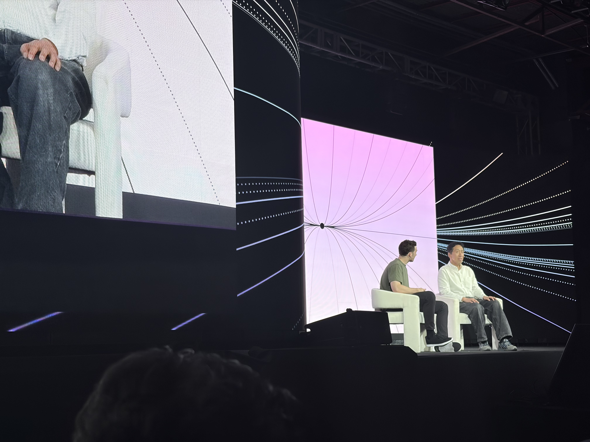
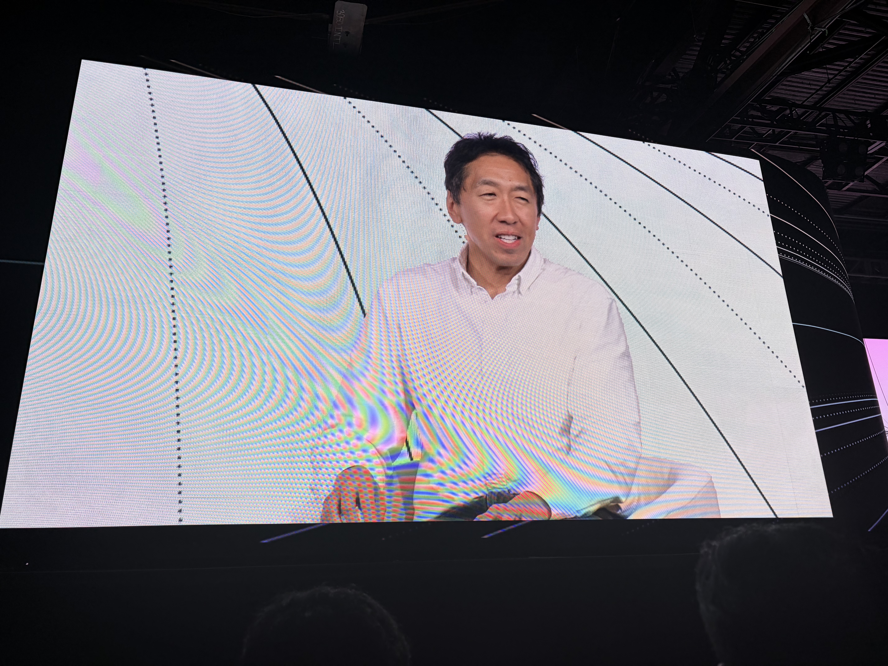
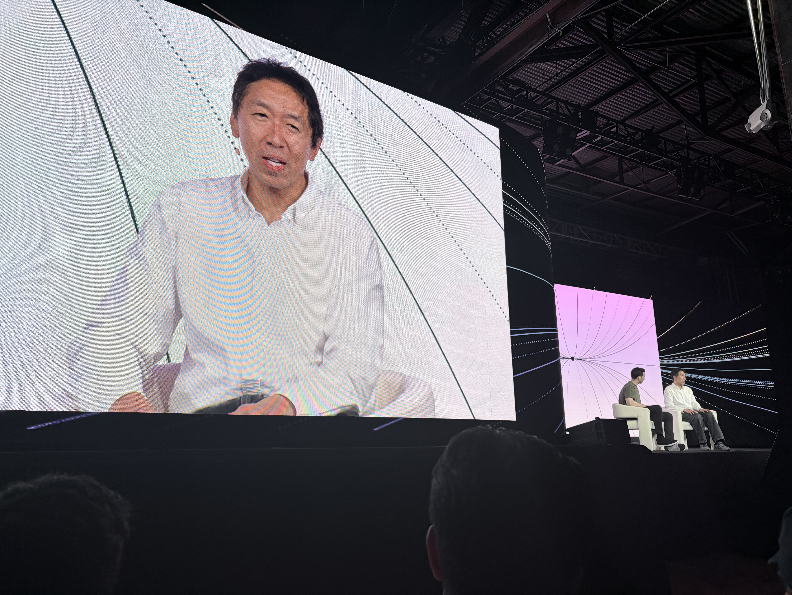
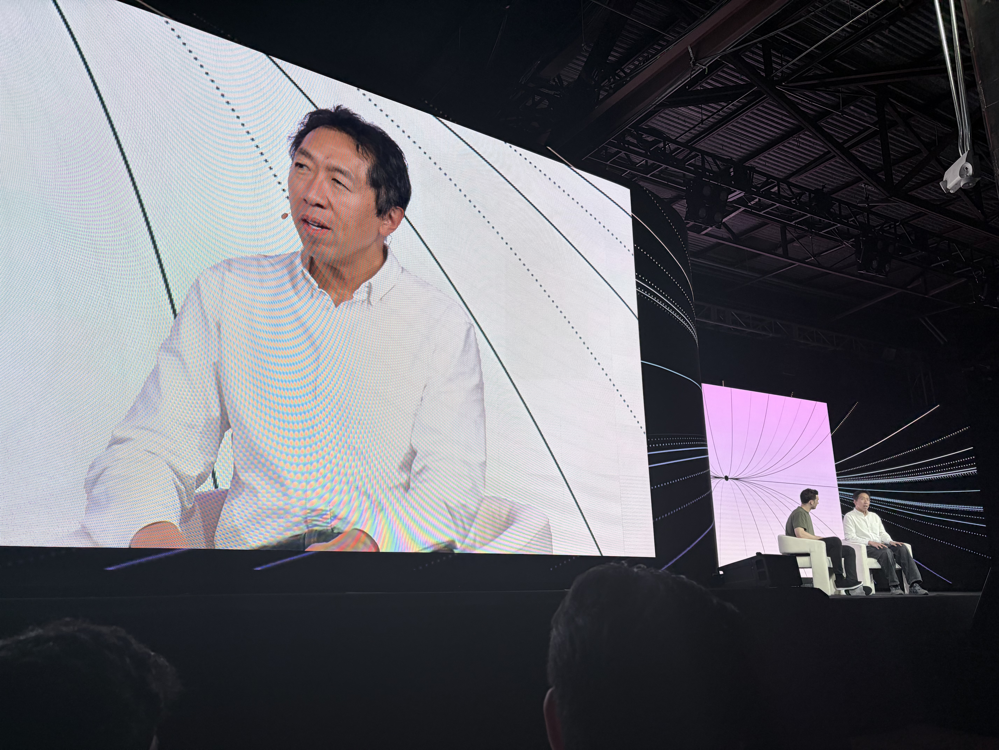
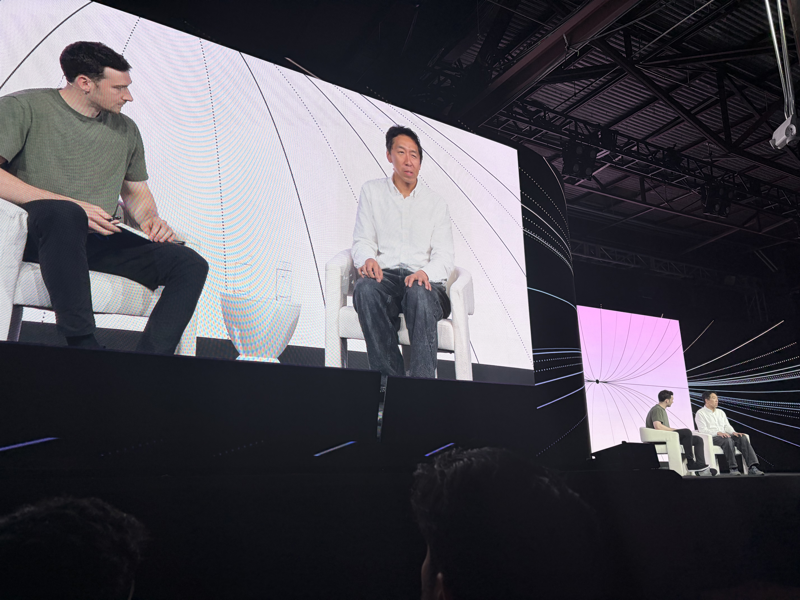

# Future of AI Agents

- 日付: 2026年5月14日
- 時間: 1:00 PM-1:30 PM
- 登壇者: Andrew Ng, Harrison Chase
- 音声: [Future of AI Agents.m4a](Future%20of%20AI%20Agents.m4a)
- 文字起こし: [Future of AI Agents_original.txt](Future%20of%20AI%20Agents_original.txt)

## 写真

*13:01 PDT 頃。Future of AI Agents セッション中の写真。*

*13:02 PDT 頃。Andrew Ng 氏と Harrison Chase 氏の fireside chat。*

*13:02 PDT 頃。Future of AI Agents セッション中の写真。*

*13:02 PDT 頃。Future of AI Agents セッション中の写真。*

*13:02 PDT 頃。Future of AI Agents セッション中の写真。*

## 要約

この fireside chat は、AI agents が software engineering、workflow design、education、enterprise adoption にどのような変化をもたらすかを議論する内容だった。自動書き起こしにはかなりノイズがあるが、議論の中心は、AI が単なる効率化ツールではなく、業務プロセスそのものの再設計を促すという点にあった。

software engineering については、従来の「大きなチームで明確に分業して作る」形から、小さく高コンテキストなチームや generalist が agent / coding tools を活用して進める形へ移る可能性が語られていた。コードを書く能力だけでなく、問題設定、system design、評価、品質管理、業務文脈の理解がより重要になる。

また、AI adoption では単に既存プロセスにAIを足すだけでは transformative business impact につながりにくい。workflow を見直し、どの判断を agent に任せ、どこに human approval を残し、何を business metric として測るのかを設計する必要がある。ROI 測定についても、コスト削減だけではなく、売上機会、スピード、品質、顧客体験など複数の軸で考える必要がある。

## 重要ポイント

- AI agents の価値は、既存作業の自動化だけでなく workflow redesign にある。
- software engineering は、より小さく高コンテキストなチームが agent を活用する方向へ進む。
- generalist / domain expert が coding agents と組むことで、実装と業務理解の距離が縮まる。
- AI導入では、どの業務判断を agent に任せ、どこに人間の判断を残すかを設計する必要がある。
- ROI はコスト削減だけでなく、速度、品質、顧客体験、売上機会も含めて測るべき。
